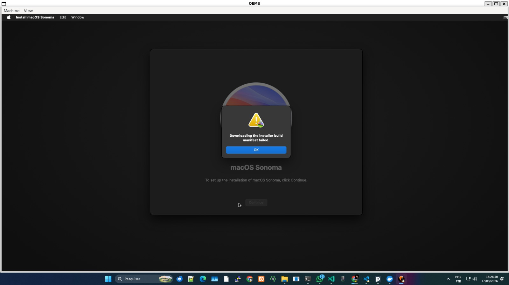

# ConfigOSX

Configuração simplificada para rodar macOS via Docker (baseado no [Docker-OSX](https://github.com/sickcodes/Docker-OSX)).

> Projeto em andamento.

---

## Requisitos básicos

- Requer WSL2
- Requer suporte a KVM

## 🚀 Uso básico

### Rodar isso aqui no ambiente WSL
```bash

docker compose up --build -d

```

---

## ⚠️ Observações
- Pode precisar de ajustes dependendo do ambiente
- Não está finalizado

---

## 🚧 Últimos B.Os pra resolver



---

## 📦 Base

Baseado em Docker-OSX (sickcodes).